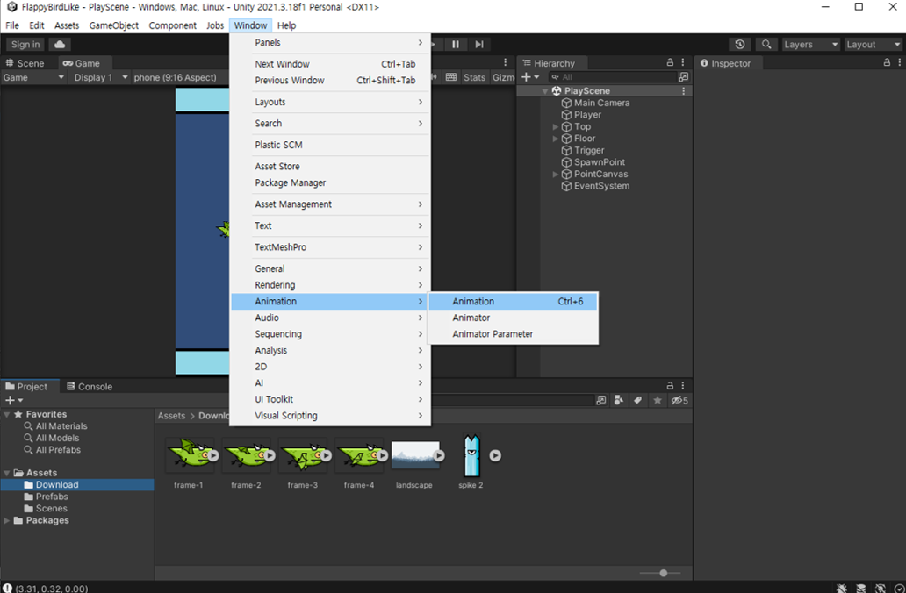
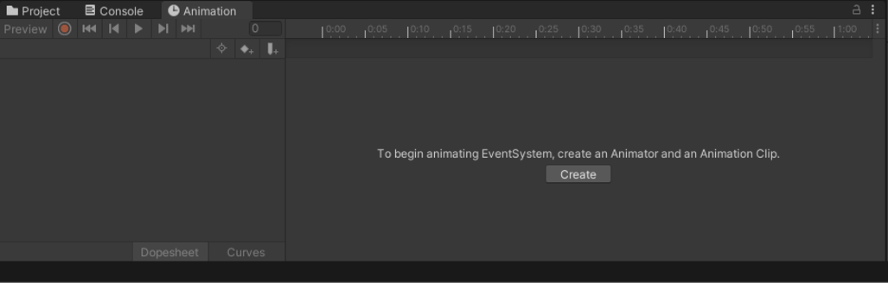
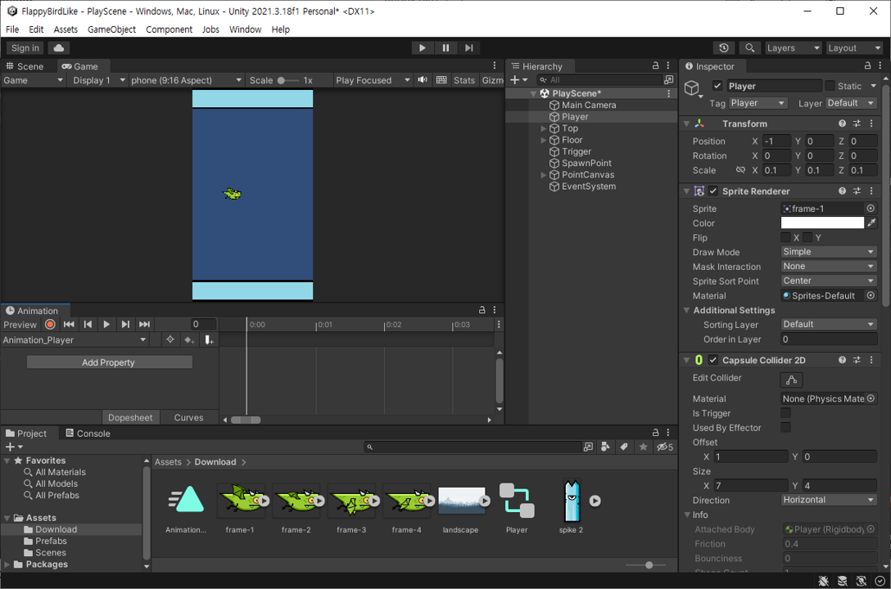
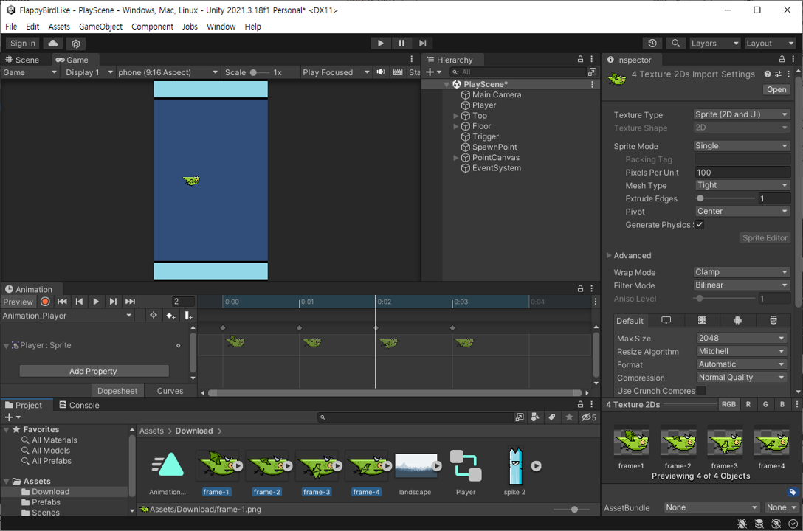
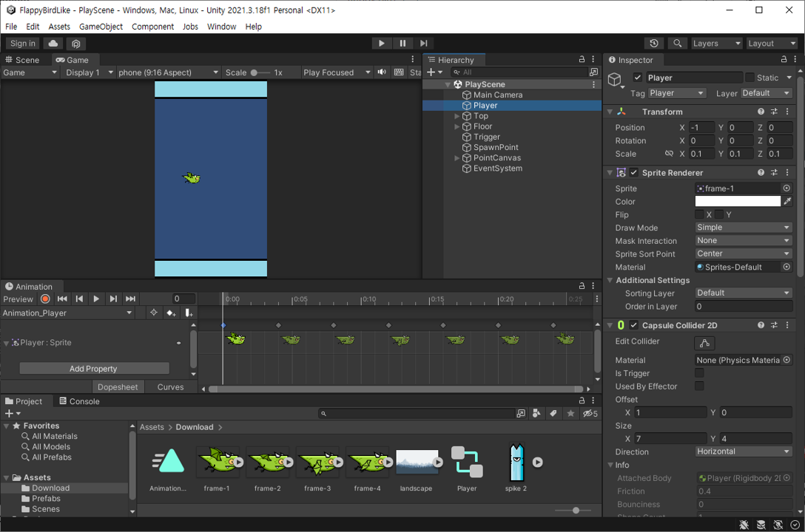
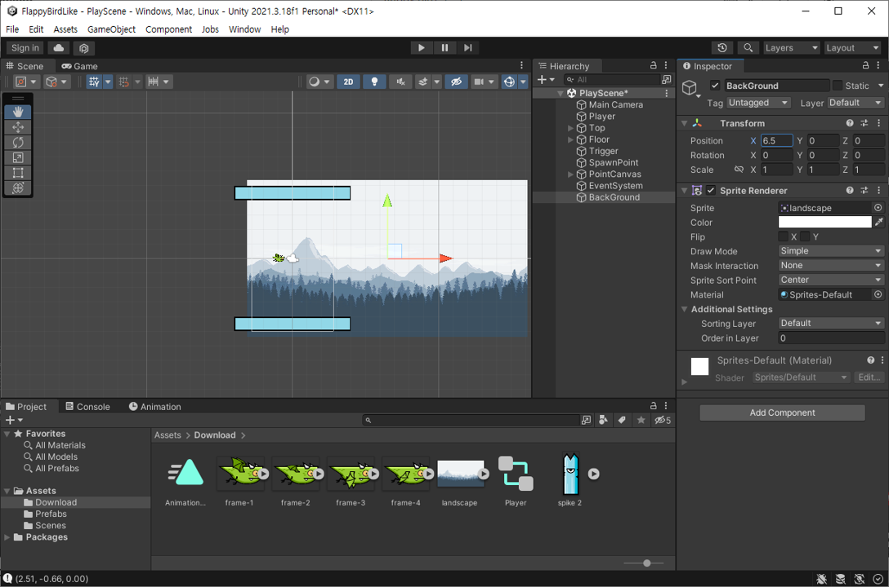
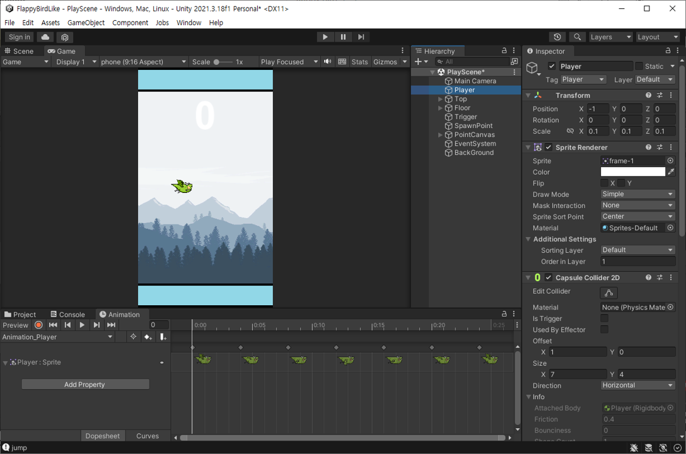
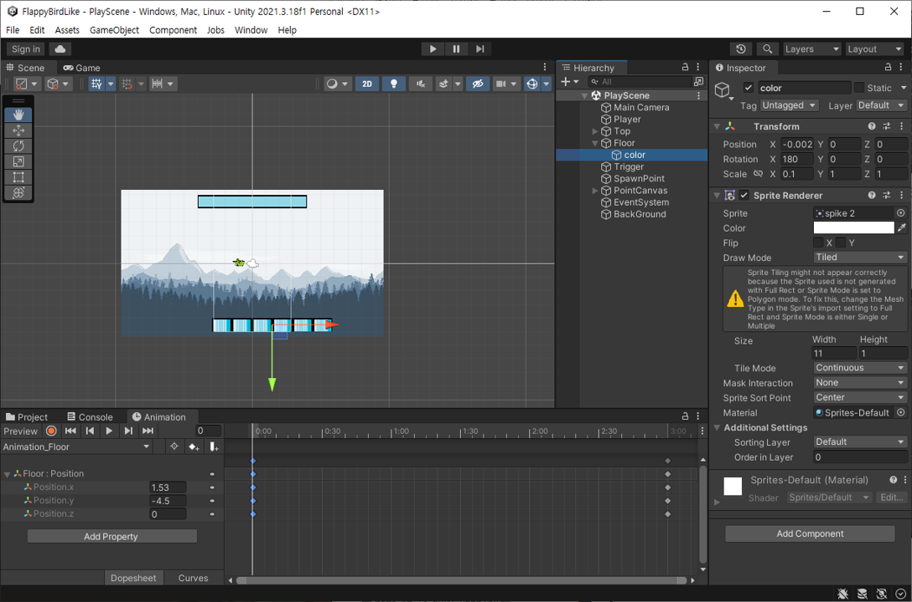
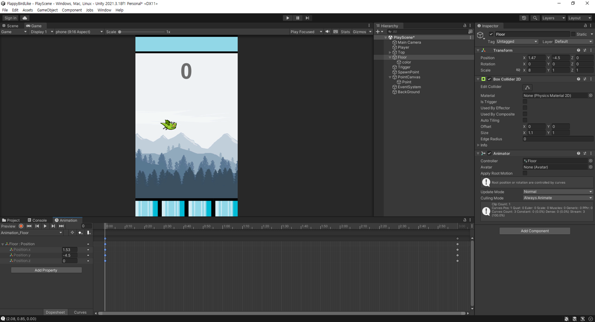
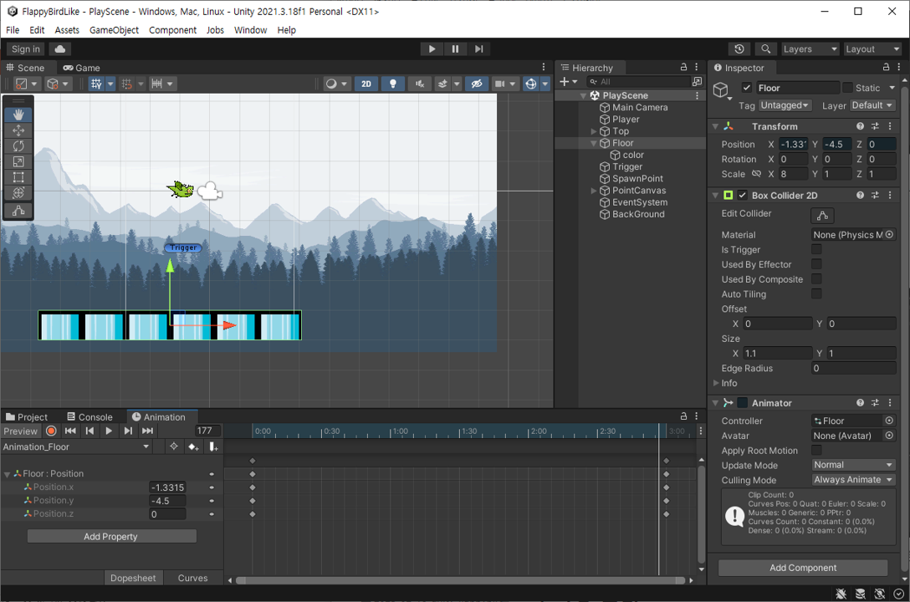

# [# U01] FlappyBirdLike 구현 #07

전체적인 게임의 틀은 완성했습니다.
게임의 퀄리티를 조금 높여보겠습니다.

# 퀄리티 업

## 애니메이션 추가

게임의 생동감을 살려주기 위해 애니메이션을 추가해 보겠습니다.

Windows > Animation > Animation을 클릭합니다.

위의 이미지처럼 Animation 창이 뜨는 것을 확인할 수 있습니다. Animation탭을 끌어서 옮길 수 있습니다.

애니메이션을 만들 오브젝트인 Player을 선택하고 Animation 창에 Create를 클릭합니다. 밑의 이미지처럼 창이 뜨는 것을 확인할 수 있습니다.

애니메이션을 만들 이미지를 그림가 같은 위치에 드래그 앤 드랍하여 애니메이션을 만들 수 있습니다. Player : Sprite 좌측 ▼ 를 클릭하면 위 이미지와 같이 화면을 볼 수 있습니다.

이미지의 순서를 더 추가하고 시간을 조정하여 만들어 더 자연스러운 애니메이션을 만들어 줍니다.

다운받은 배경이미지를 Scene에 드래그 앤 드랍하여 오브젝트를 만들어 줍니다. 

게임을 실행했을 때 플레이어가 사라지거나 깜빡이는 경우가 발생할 수 있습니다.  이것은 Order in Layer을 통해 수정할 수 있습니다. **Order in Layer는 보여줄 우선순위를 정해줍니다.** 숫자가 크면 클수록 우선순위가 높아집니다.

플레이어가 움직이는 것처럼 보이기 위해 바닥을 기존의 Spike를 통해 조금 변경했습니다. Draw Mode를 Tiled로 바꾸면 타일처럼 이미지를 그릴 수 있습니다. 이를 통해 바닥을 각진 벽돌처럼 표현했습니다. 그리고 포인트 부분의 텍스트 색을 잘 보일 수 있는 색으로 변경했습니다.

Floor을 선택하고 애니메이션을 추가합니다. 애니메이션을 빨간색원 버튼을 통해서 처음위치에서 원하는 초를 클릭하고 우측으로 이동하여 빨간색원 버튼을 다시 눌러줍니다.

조금 어려울 수 있지만 위의 이미지처럼 자연스럽게 초를 찍어 만들어 줍니다.

## 효과음 추가

