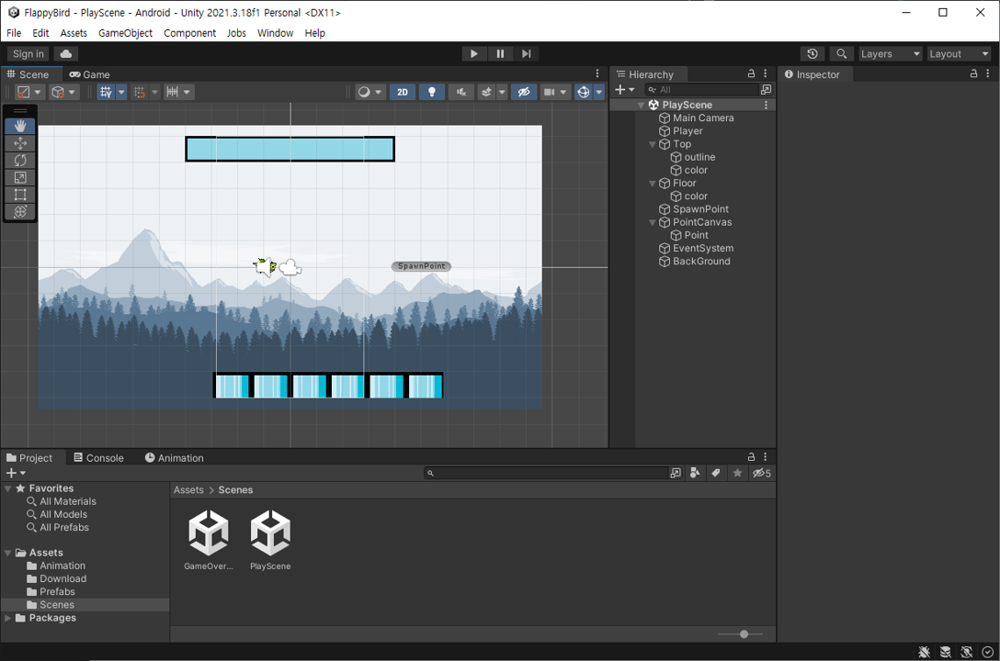
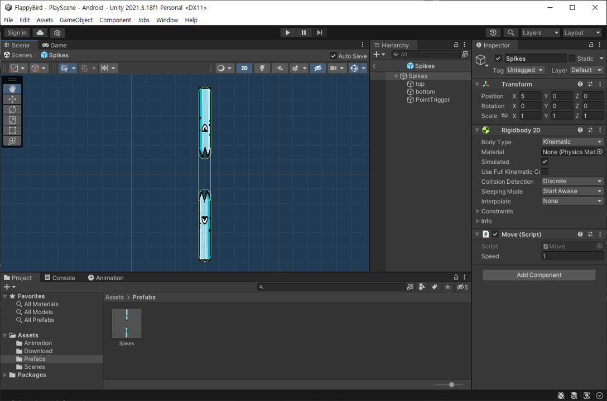
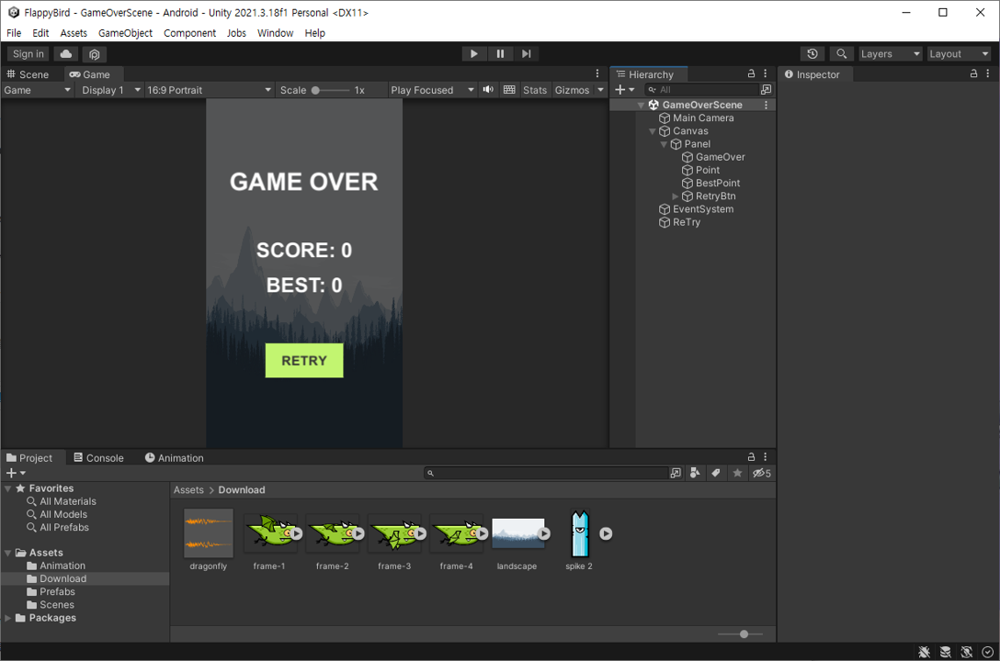

# [# U01] FlappyBirdLike 구현 #08
# 총정리

## PlayScene

**-PlayScene-**



**-Prefabs-**



**-컴포넌트-**

|오브젝트|추가 컴포넌트|
|---|---|
|Player|CapsuleCollider2D, Rigidbody2D, **PlayerController스크립트**, Animator, AudioSource|
|Top|BoxCollider2D|
|Floor|BoxCollider2D, Animator|
|SpawnPoint|**Spawner스크립트**|
|PointCanvas|UI(캔버스)|
|Point|**Point스크립트**|
|BackGround|없음|
|Spikes(Prefabs)|Rigidbody2D, **Move스크립트**|
|top,bottom(Prefabs)|CapsuleCollider2D|
|PointTrigger(Prefabs)|BoxCollider2D, **PointUp스크립트**|


**-PlayerController 스크립트-**
```c#

using UnityEngine.SceneManagement;

public class PlayerController : MonoBehaviour
{
    // Rigidbody변수 선언
    Rigidbody2D RB_Player;
    // 점프세기
    public float JumpPower = 5f;

    void Start(){
        RB_Player = GetComponent<Rigidbody2D>();
    }

    void Update(){
        if(Input.GetMouseButtonDown(0)){
            GetComponent<AudioSource>().Play();
            RB_Player.velocity = Vector2.up * JumpPower;
        }
    }

    // 플레이어가 다른 콜리전과 부딪혔을 때 실행
    private void OnCollisionEnter2D(Collision2D other){
        // 최고점수 저장
        if(Point.point > Point.bestpoint){
            Point.bestpoint = Point.point;
        }
        SceneManager.LoadScene("GameOverScene");
    }
}

```


**-Spawner 스크립트-**

```c#

public class Spawner : MonoBehaviour
{
    // Prefab을 받아올 변수 선언
    public GameObject spikes;
    // 리스폰 시간
    public float SpawnTime = 3f;
    // 타이머
    float timer = 0;
    
    void Start(){
        
    }

    void Update(){
        timer += Time.deltaTime;
        if(timer > SpawnTime){
            GameObject spawnspike = Instantiate(spikes);
            spawnspike.transform.position = new Vector3(5, Random.Range(-1.5f, 1.5f), 0);
            Destroy(spawnspike, 10.0f);

            timer = 0;
        }
    }
}


```


**-Point 스크립트-**

```c#

using UnityEngine.UI;

public class Point : MonoBehaviour
{
    // 점수 변수
    public static int point = 0;  
    // 최고 점수 변수
    public static int bestpoint = 0;  
   
    void Start(){
        point = 0;
    }

    void Update(){
        GetComponent<Text>().text = point.ToString();
    }
}

```


**-Move 스크립트-**

```c#

public class Move : MonoBehaviour
{
    // 장애물이 나오는 시간 조정 변수
    public float speed = 1f;

    void Start(){
        
    }

    void Update(){
        // transform.position = transform컴포넌트의 position값
        // Vector3.left = (-1,0,0) 
        // 프레임 단위는 환경마다 다르기 때문에 Time.deltaTime을 활용한다.
        transform.position += Vector3.left * speed * Time.deltaTime;
    }

}

```


**-PointUp 스크립트-**

```c#

public class PointUp : MonoBehaviour
{
    // 한번만 점수를 올리기 위한 변수
    int count = 0;
    private void OnTriggerExit2D(Collider2D other){
        if(count==0){
            Point.point++;
            count++;
        }
    }
}

```


## GameOverScene
**-GameOverScene-**



**-컴포넌트-**

|오브젝트|추가 컴포넌트|
|---|---|
|Cnavas|없음|
|Panel|없음|
|GameOver|없음|
|Point|**EndPoint스크립트**|
|BestPoint|**BestPoint스크립트**|
|RetryBtn|없음|
|Retry|**Retry스크립트**|


**-EndPoint 스크립트-**

```c#

using UnityEngine.UI;

public class EndPoint : MonoBehaviour
{
 
    void Start(){
        GetComponent<Text>().text = "SCORE: " + Point.point.ToString();
    }

}


```


**-BestPoint 스크립트-**

```c#

using UnityEngine.UI;

public class BestPoint : MonoBehaviour
{
   
    void Start(){
        GetComponent<Text>().text = "BEST: " + Point.bestpoint.ToString();
    }

}

```


**-Retry 스크립트-**

```c#

using UnityEngine.SceneManagement;

public class Retry : MonoBehaviour
{
    public void RetryGame(){
        SceneManager.LoadScene("PlayScene");
    }
}

```


# 회고

다양한 에셋들을 다운받아 좀더 높은 퀄리티의 게임을 만들거나 이번에 만든 게임을 조금씩 변형시키면 쿠키런같은 러닝액션게임도 만들 수 있습니다. 

저는 FlappyBird를 만들며 Unity의 기본적인 기능들을 많이 배웠습니다. 프로그래밍의 기본지식을 어느정도 알고 있으면 쉽게 게임을 만들 수 있습니다. 다음부터는 더 간단하게 코드와 오브젝트등만 올려 포스팅을 할 예정입니다.